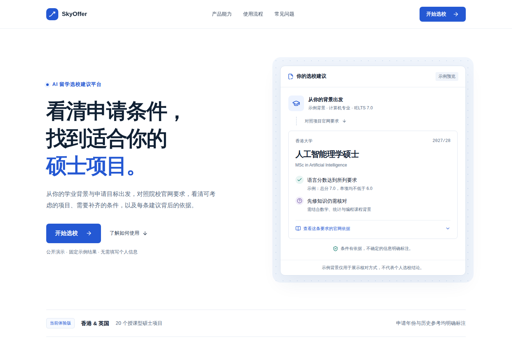

# SkyOffer

**Understand admissions requirements. Make informed master's program choices.**

[Live demo](https://hexing-ai.github.io/SkyOffer/) · [中文](README.md) · [Architecture](docs/ARCHITECTURE.md)



SkyOffer compares an applicant's background with official requirements for taught master's programs in Hong Kong and the UK. Deterministic rules evaluate conditions; AI explains the results without changing them. Each requirement can link back to official evidence.

## What works today

- A product homepage, selection workspace, searchable program catalog and browser-local applicant profile.
- 20 reviewed Beta candidate programs, covering computing, AI and aerospace-related subjects.
- Explicit missing-information and manual-review states, with source dates and academic years.
- Separate 2026/27 historical references; these do not establish eligibility for 2027/28.
- Conservative rule-based explanations when the model is unavailable.

The UI is currently in Chinese. Meeting a requirement is not an admission guarantee. SkyOffer does not estimate admission probabilities.

## Run the demo — no API key or backend

Requires Node.js 22 and Git:

```bash
git clone https://github.com/hexing-ai/SkyOffer.git
cd SkyOffer/frontend
npm ci
npm run demo
```

Open http://127.0.0.1:3200/. The read-only demo uses a fixed synthetic profile and real rule-engine output. It does not collect personal information or call a live AI model. Its source snapshot is dated 2026-09-07.

## Run the complete application

Requires Python 3.11, Node.js 22 and a DeepSeek API key:

```bash
# Repository root, macOS / Linux
python3.11 -m venv .venv
source .venv/bin/activate
pip install -r requirements.txt
cp .env.example .env
# Edit .env locally and set MODEL_API_KEY.
python -m backend.scripts.bootstrap_internal_alpha
uvicorn backend.app.main:app --host 127.0.0.1 --port 8001
```

In a second terminal, run `npm ci` and `npm run dev` in `frontend/`. The frontend opens at http://127.0.0.1:3200/. Stop demo mode before starting full mode on the same port.

Your model provider may charge for API calls. Keep credentials on the server. Local development uses SQLite; production configuration requires PostgreSQL. See [installation](docs/INSTALLATION.md) and [production deployment](PRODUCTION_READINESS.md).

## Contribute

See [CONTRIBUTING.md](CONTRIBUTING.md). Requirement updates need official sources, academic years and verification dates. Never include real applicant records or API keys in public issues.

If you find the project useful, a Star helps others discover it.

Code: [MIT](LICENSE). Third-party institutional material: [NOTICE](NOTICE).
