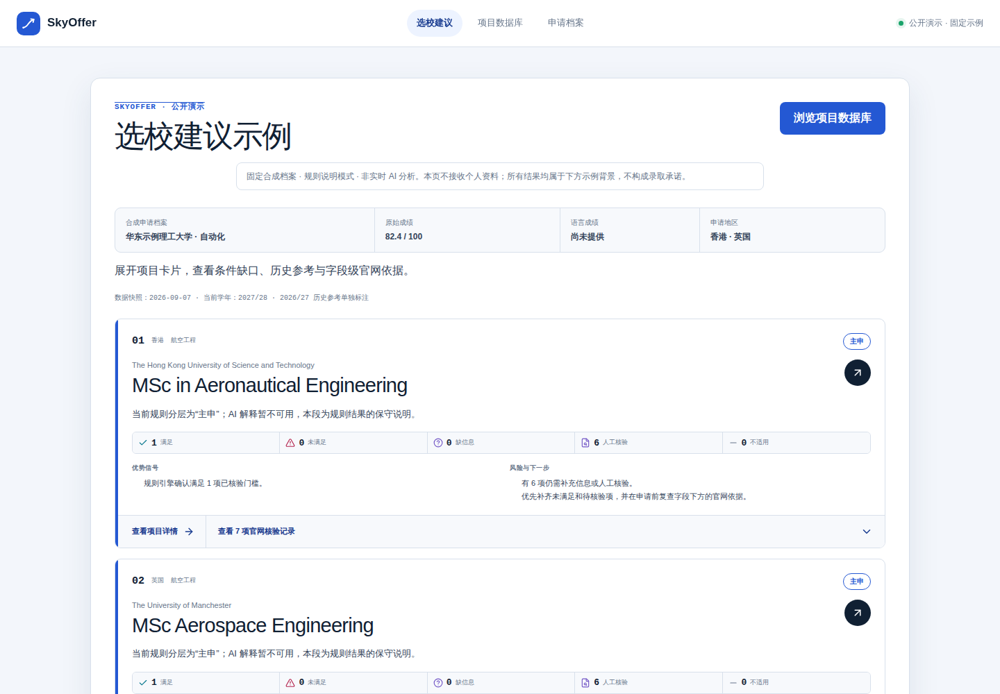
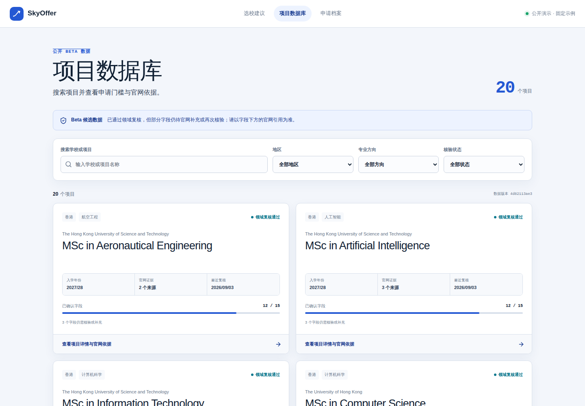
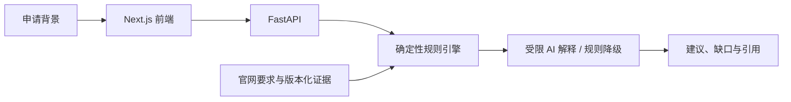

<div align="center">

# SkyOffer

**看清申请条件，找到适合你的硕士项目。**

面向香港与英国授课型硕士申请者的选校工具：用规则核对条件，用 AI 解释建议，用官网依据支持判断。

[在线 Demo](https://hexing-ai.github.io/SkyOffer/) · [快速开始](#快速开始) · [架构](docs/ARCHITECTURE.md) · [English](README.en.md)

[](https://github.com/hexing-ai/SkyOffer/actions/workflows/ci.yml)
[](LICENSE)

</div>


## 为什么做 SkyOffer

选校时，真正费时的是把自己的背景与分散在院校官网里的要求逐项对上：专业是否相关？语言单项够不够？缺少哪些材料？看到的要求适用于哪一年？

SkyOffer 把这些信息放在一起，给每个判断保留来源，也明确标出不知道的部分。

- **选校建议**：逐项核对条件，展示缺口、待核验项和下一步准备事项。
- **项目数据库**：按地区、方向搜索项目，查看字段级官网引用及核验日期。
- **申请档案**：完整版本支持在当前浏览器保存背景，再自动带入选校表单。
- **有边界的 AI**：规则决定判断，模型只负责解释；模型不可用时明确降级为规则说明。

当前体验版收录 **20 个项目**，主要涉及计算机、人工智能与航空工程等相关方向。数据面向 **2027/28**；部分项目只有单独标注的 **2026/27 历史参考**。项目处于经过领域复核的 Beta 候选版本，仍有字段待核实。满足门槛不等于获得录取，建议不提供录取概率或保底承诺。

## 先体验，再决定是否安装

打开 **[在线 Demo →](https://hexing-ai.github.io/SkyOffer/)**，点击“开始选校”，查看固定合成档案的结果，再展开官网依据。

| 模式 | 可以做什么 | 需要什么 |
| --- | --- | --- |
| 在线 / 本地示例版 | 浏览首页、20 项数据库、示例档案和规则结果 | 无账号、无模型密钥、无后端 |
| 完整版本 | 输入自己的背景，调用规则引擎与 DeepSeek 生成建议 | Python、Node.js、数据库与服务端模型密钥 |

公开 Demo 是只读快照，**不接收个人资料，不进行实时 AI 分析**。示例使用合成档案和实际规则引擎生成，解释采用已标注的规则降级模式。快照日期为 2026-09-07，最新要求请以院校官网为准。

## 快速开始

安装 [Node.js 22](https://nodejs.org/) 与 Git 后，在终端运行：

```bash
git clone https://github.com/hexing-ai/SkyOffer.git
cd SkyOffer/frontend
npm ci
npm run demo
```

打开 **http://127.0.0.1:3200/**。看到 SkyOffer 首页即启动成功；“开始选校”可查看示例结果，项目数据库支持搜索和详情查看。此路径不需要 Python、Docker 或 API Key，依赖安装时间取决于网络速度。

### 使用自己的背景运行完整版本

需要 Python 3.11、Node.js 22。以下为 macOS / Linux 命令；Windows 和完整配置见 [安装指南](docs/INSTALLATION.md)。

```bash
# 在仓库根目录
python3.11 -m venv .venv
source .venv/bin/activate
pip install -r requirements.txt
cp .env.example .env
```

在本机编辑 `.env`，填写 `MODEL_API_KEY`，不要提交这个文件。然后：

```bash
python -m backend.scripts.bootstrap_internal_alpha
uvicorn backend.app.main:app --host 127.0.0.1 --port 8001
```

另开终端：

```bash
cd SkyOffer/frontend
npm ci
npm run dev
```

打开 http://127.0.0.1:3200/ → 开始选校。就绪检查为 http://127.0.0.1:8001/api/v1/ready，成功时返回 `status: ready`、`program_count: 20`。

更改运行模式前停止前一个前端进程，以免占用同一端口。调用 DeepSeek 可能产生模型费用，由你配置的服务账号承担。

## 界面预览

| 选校建议与官网依据 | 项目数据库 |
| --- | --- |
|  |  |

<details>
<summary>查看手机端首页</summary>


</details>

截图来自 Chromium 实际渲染的公开示例版本；生成脚本同时检查入口跳转、数据加载、证据展开与小屏溢出。

## 技术与数据



前端使用 Next.js、React、TypeScript 和 Zod；后端使用 FastAPI、Pydantic、SQLAlchemy 与 Alembic。本地采用 SQLite，生产配置要求 PostgreSQL。

- [架构与判断流程](docs/ARCHITECTURE.md)
- [安装、运行与排错](docs/INSTALLATION.md)
- [数据来源与适用边界](docs/DATA.md)
- [生产部署](PRODUCTION_READINESS.md)
- [产品范围](PRD.md) · [技术说明](TECH_SPEC.md)

## 开发与贡献

```bash
# 仓库根目录，已激活 Python 环境
pytest -q

# frontend 目录
npm run lint
npm run typecheck
npm test
npm run build
npm run build:demo
```

参见 [贡献指南](CONTRIBUTING.md)。欢迎提交可复现的问题、官网来源更新或交互改进；涉及院校门槛的变更请带上官方链接、适用学年及核验日期。不要在 Issue 中提交密钥或真实申请档案。

近期方向：扩大经过复核的项目覆盖、完善缺失字段、增加易读的项目比较与结果导出。以上属于路线图，尚未实现。

如果 SkyOffer 帮你理解了如何做有依据的选校，欢迎 **Star**，也欢迎用 Issue 告诉我们哪里还不够清楚。

代码采用 [MIT](LICENSE)；院校名称、官网引用等第三方内容权利归原权利人，详见 [NOTICE](NOTICE)。
