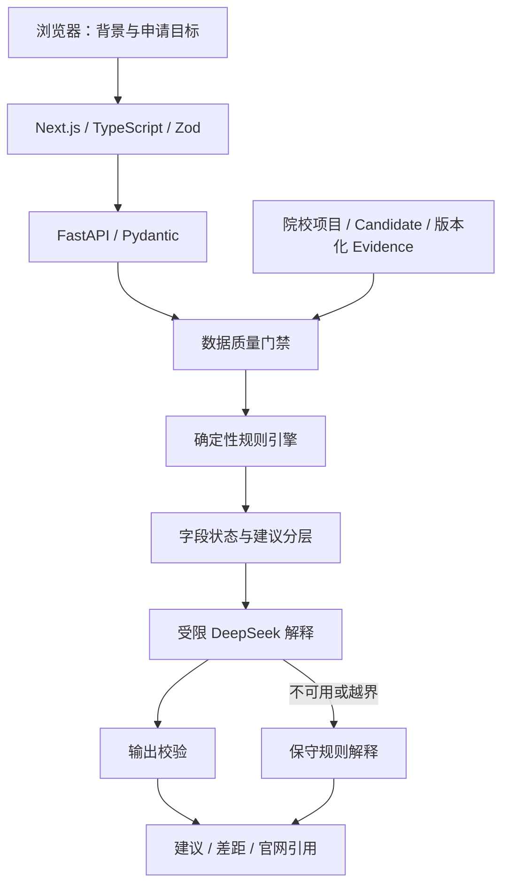

# SkyOffer 架构

## 两个运行模式

完整模式运行 Next.js 前端与 FastAPI 后端，前端通过同源 `/api/v1/*` 代理调用后端。示例模式导出静态页面，仅读取公开数据快照，不启动后端，不接收个人分析请求；两者复用项目卡片和数据库界面。

## 关键边界

- 规则引擎输出满足、未满足、缺信息、人工核验和不适用五态；不借助模型补全未知官网事实。
- 模型只能解释已有判断，不能改变分层、门槛状态或引用。输出经过结构与内容限制检查。
- 2026/27 历史参考独立计算和展示，不进入 2027/28 分层或模型提示。
- 当前正式 Published Manifest 为空。20 个项目通过内部质量门禁以候选版本供 Beta 使用，界面明确呈现待核验字段。
- 浏览器申请档案通过 localStorage 保存；用户主动生成建议时，输入才提交到完整模式后端及所配置的模型服务。

## 代码地图

| 路径 | 职责 |
| --- | --- |
| `frontend/app/` | 首页、选校、数据库、档案路由 |
| `frontend/components/` | 表单、结果卡片、官网引用、公开演示 |
| `frontend/lib/` | API、前端校验、档案存储 |
| `backend/app/api/` | HTTP 接口 |
| `backend/app/rules/` | 纯规则求值与领域分类 |
| `backend/app/services/` | 选校编排、模型解释、项目查询、数据门禁 |
| `backend/app/repositories/`、`db/` | 数据持久化与版本操作 |
| `backend/data/alpha_v1/` | 项目要求、版本、来源与历史参考 |
| `backend/alembic/` | 数据库迁移 |
| `frontend/demo/`、`frontend/public/demo/` | 可复现的公开示例快照 |

## 示例快照的生成

运行 `python -m backend.scripts.export_demo`。脚本读取仓库自带合成档案，在临时 SQLite 中引导项目数据，调用真实规则引擎，并使用不会连接网络的模型替身触发现有规则降级说明。它不读取 `.env` 或现有数据库，不使用真实用户资料。快照时间固定，页面清楚标为示例。

## 生产边界

生产模式检查 PostgreSQL、显式 Host、限流、JSON 日志及模型配置。公网仅应开放经过网关授权的用户接口，维护与验收接口必须位于受认证的内网；详见生产说明。仓库没有实现用户账号系统、组织权限管理或跨设备档案同步。

## 性能目标与共享 CI

功能 CI 与硬件相关的性能测试分开运行。原有 100 项规则、每项 50 节点的核心 p95 目标仍为 100 ms，未修改或删除。首次 GitHub 共享 runner 实测约 268 ms，没有达到该目标；本机测试通过并不能代表任意服务器的表现。

CI 的 `Performance target (informational)` 独立运行基准，保留报告及失败状态但不阻止功能发布。部署前应在目标硬件运行 `python -m backend.scripts.benchmark_requirement_engine` 评估，不应把本仓库解读为生产延迟承诺。
